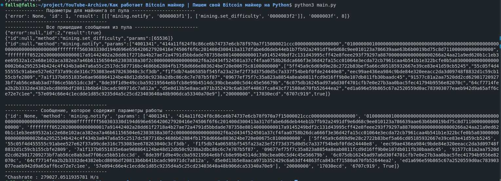

## Полезные ссылки
**Ссылка на видео:** https://www.youtube.com/watch?v=671xP_1NMUA&ab_channel=MINUX

**Официальный сайт:** minux.pro

**Наш GitHub:** github.com/MINUX-organization

**Новостной канал:** @minuxos

**Главный разработчик:** @MINUX_organization

**Чат:** @minux_wait_list

**YouTube:** www.youtube.com/@MINUX-Organization

**VK:** vk.com/minux_organization

## Установка зависимостей
**Python version:** 3.12.3

Необходимо установить библиотеки
```bash
pip3 install -r requirements.txt
```

## Запуск
Для запуска введите команду
```python
python3 main.py
```

Пример работы


