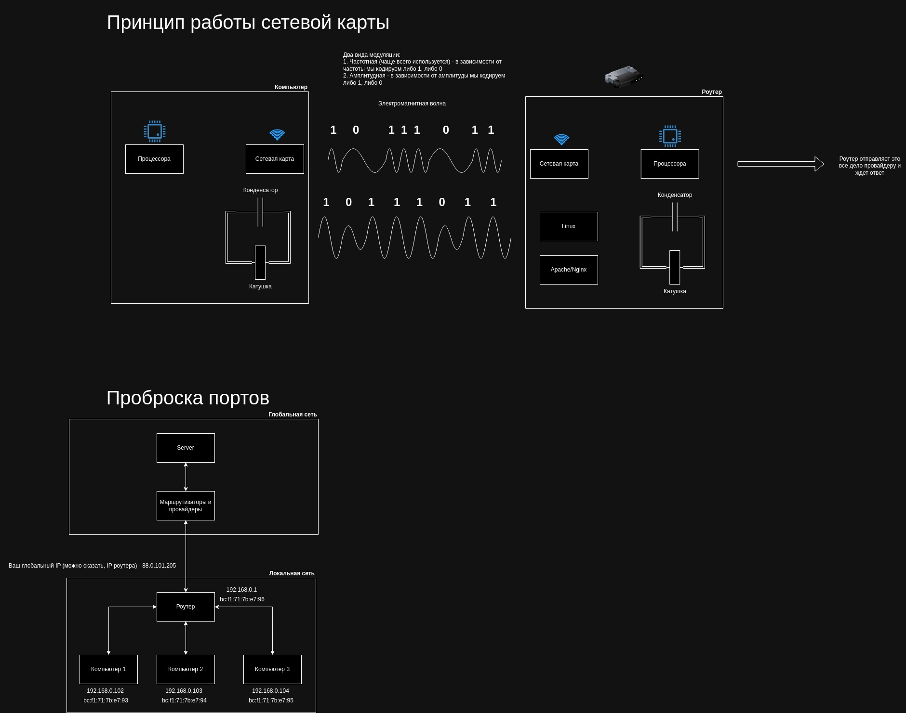
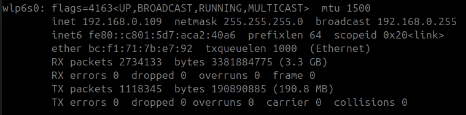
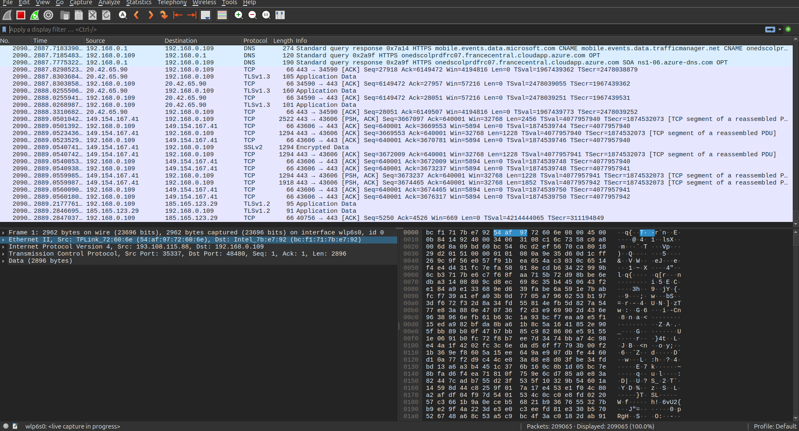
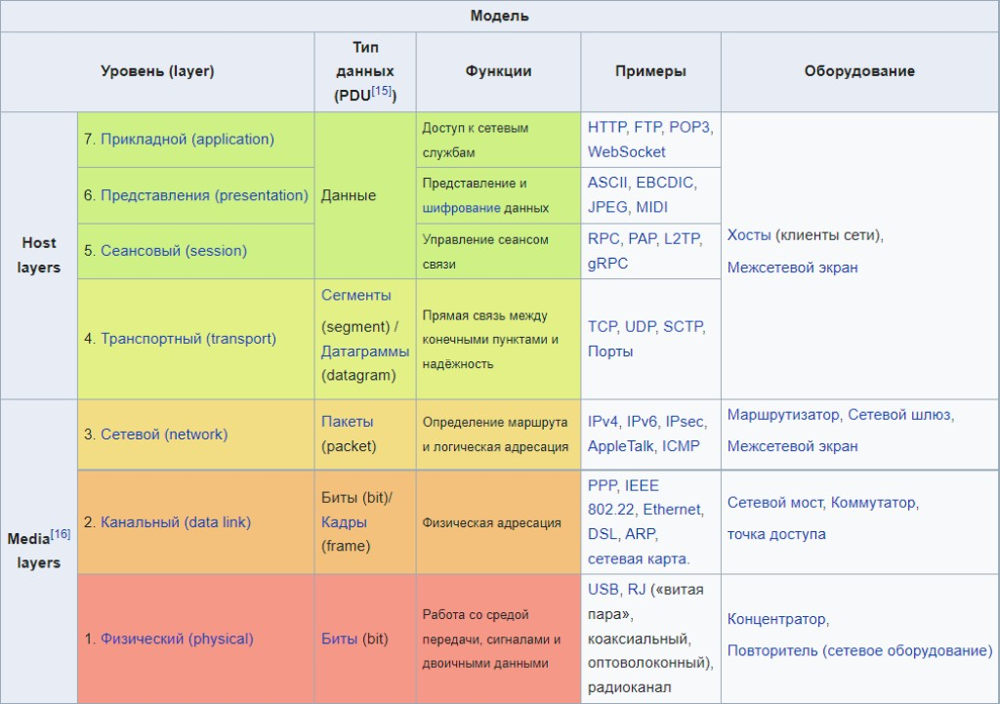
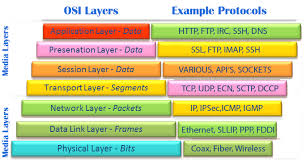
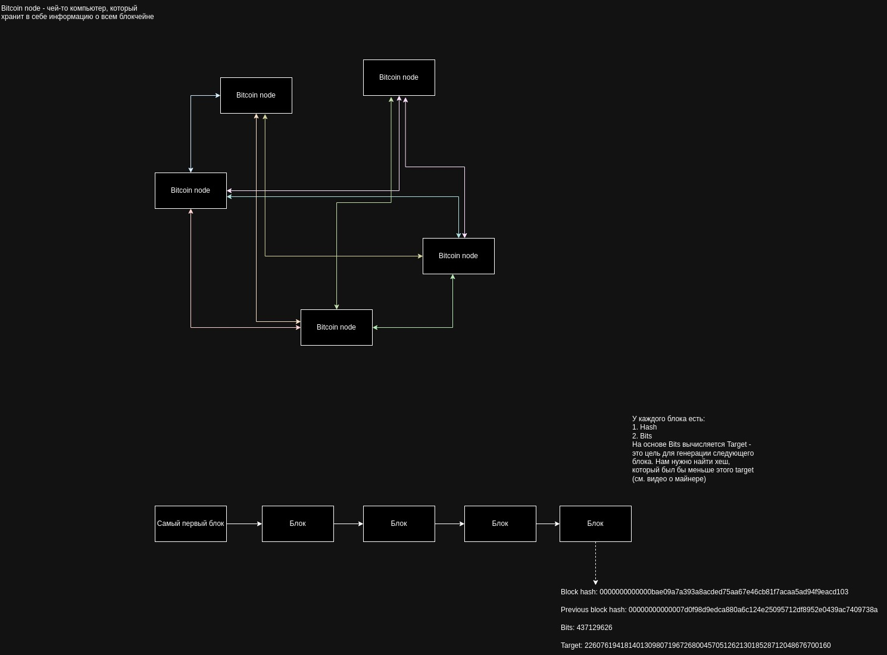

## Полезные ссылки
**Ссылка на видео 1:** https://www.youtube.com/watch?v=P_9ox-ZnNss&ab_channel=MINUX
**Ссылка на видео 2:** https://www.youtube.com/watch?v=MITvUtYFGqg&ab_channel=MINUX

**Официальный сайт:** minux.pro

**Наш GitHub:** github.com/MINUX-organization

**Новостной канал:** @minuxos

**Главный разработчик:** @MINUX_organization

**Чат:** @minux_wait_list

**YouTube:** www.youtube.com/@MINUX-Organization

**VK:** vk.com/minux_organization

**Подробное видео о сетях:** https://www.youtube.com/watch?v=PYHKOwBfsLI&ab_channel=YuriySemyenkov

## Установка зависимостей
**Python version:** 3.12.3

Необходимо установить библиотеки
```bash
pip3 install -r requirements.txt
```

# Как работает интернет
## Модуляция и сетевая карта


## Информация о сетевой карте
Для получения информации о карте в Ubuntu нужно ввести команды
```bash
sudo apt install net-tools
ifconfig
```



**inet 192.168.0.109** - локальный IP, который вам выдал роутер
**RX packets** - сколько байт было получено (R - Receive)
**TX packets** - сколько байт было отправлено (T - Transfer)
**ether** - MAC-адрес вашего сетевого адаптера
**netmask** - маска сети. В каком диапазоне меняются IP адреса у клиентов роутера

## Информация о пакетах
Для отслежки пакетов необходима программа Wireshark

Установка в Ubuntu
```bash
sudo apt install wireshark
```



## Модель OSI



## Запуск
### UDP
В первом терминале пишем
```bash
python3 server.py
```

Во втором терминале пишем
```bash
python3 client.py
```

### TCP
В первом терминале пишем
```bash
python3 server.py
```

Во втором терминале пишем
```bash
python3 client.py
```

# Как работает блокчейн

